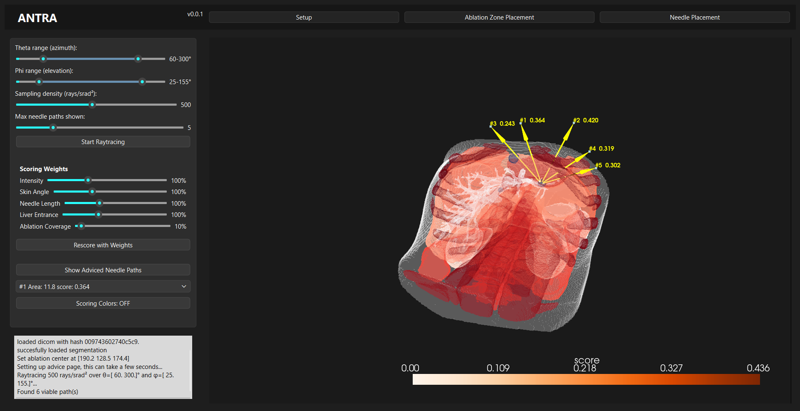

# ANTRA: Ablation Needle Trajectory Advisor

ANTRA is a tool for assisting liver ablation planning. When given a CT scan (DICOM series) as input, the multi-stage pipeline generates anatomical segmentations, analyzes paths through surrounding structures using voxel raytracing, and outputs candidate needle trajectories from a user-defined ablation center.

The goal of ANTRA is to support pre-op needle trajectory planning by identifying viable needle insertion paths while accounting for segmented anatomical structures.



### Scoring Factors
Currently, ANTRA analyzes needle ablation trajectories for relevant scoring data and scores them based on five factors:
- Critical tissue penetration (Illumination based scoring)
- Skin-needle puncture angle
- Needle trajectory length
- Healthy liver entrance
- Full ablation tumor coverage

## Usage

At the moment, Antra is not yet fitted for compilation and only distributed as source code. Running the python script directly or via the bat files is the only supported form of usage. Code was tested with python 3.13.

#### Setup
1. Clone the repository:
```
git clone https://github.com/QueasyQuery/ANTRA
```

2. Run `setup.bat` once to install all dependencies.
3. Place a CT scan DICOM folder inside `/scans/`
4. Configure the desired needle parameters in `/config/general.ini`
#### Running ANTRA
1. Launch the application using `run_tool.bat`
2. Select Import New Scan and choose the desired DICOM folder.
3. Click Start Segmentation.
- Segmentation may take 10+ minutes on systems without CUDA acceleration.
- Completed segmentations can be reused later through Load Past Segmentation.
4. Open the Ablation Zone Selection tab.
- Select the desired ablation center.
- Click Confirm Selected Point.
5. Open the Needle Placement tab.
- Choose a ray-tracing range and click Raytrace.
- Adjust trajectory scoring weights as desired and click rescore.
- Click Show Advised Needle Paths to see needle trajectories.

## Disclaimer
Please note that ANTRA is a research prototype and is not intended to be used as a real clinical decision-making tool for patient treatment.

## Acknowledgements

 - [TotalSegmentator (used for anatomical segmentation)](https://github.com/wasserth/totalsegmentator)